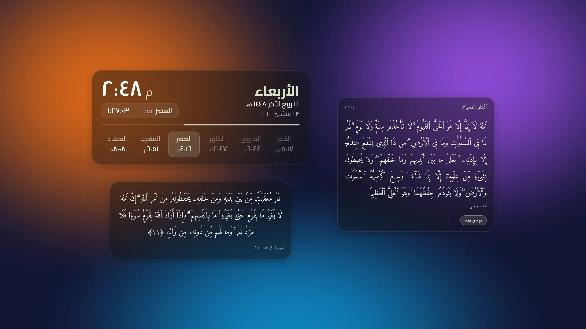

# 🕋 مِيقَات (Meqat) - Islamic Desktop Widget

A beautifully designed, Glassmorphism-inspired Islamic prayer times widget for Windows. Designed to sit elegantly on your desktop without cluttering your workspace, providing accurate prayer times, offline support, and complete UI customization.

<p align="center">
  <a href="https://github.com/Mo1Amin/Meqat-Widget/releases/latest"></a>
  
  
  
  
</p>



## ✨ Features

* **Glassmorphism UI:** Modern, translucent, and sleek Apple-like aesthetic that blends with any desktop wallpaper.
* **Offline-First Architecture:** Intelligently caches prayer times. If the internet disconnects, the widget seamlessly falls back to stored data.
* **Always on Top:** Pin the widget to float above all other windows for quick viewing.
* **Smart Audio System:** Plays specific Azan audio for Fajr and a standard Azan for other prayers. Includes a quick-mute toggle.
* **Customization Hub:** Adjust widget scale, theme color, Arabic fonts (Cairo, Aref Ruqaa, Amiri), numeral styles (١٢٣ vs 123), and 12/24 hour formats via an intuitive Glass Modal setting screen.
* **Taskbar Hidden:** Operates silently in the background via the System Tray without cluttering your main taskbar.

## 🚀 Tech Stack

* **Frontend:** React, TypeScript, Vite
* **Backend & System Integration:** Tauri, Rust
* **Styling:** Vanilla CSS (CSS Variables, Flexbox, Keyframe Animations)
* **API:** Aladhan API (For dynamic prayer time fetching based on geolocation/city)

## 📥 Installation & Usage

1. Go to the [Releases](https://github.com/Mo1Amin/Meqat-Widget/releases) page.
2. Download the latest `miqat_1.2.0_x64-setup.exe` file.
3. Install and run the application.
4. **Controls:** * **Left-Click** on the tray icon to show the widget.
   * **Right-Click** on the widget to open the Settings Panel.
   * **Drag & Drop** from the clock or prayer times area to move the widget around your screen.

## 🛠️ Development

To run this project locally:

```bash
# Install dependencies
npm install

# Run in development mode
npm run tauri dev

# Build for production
npm run tauri build
